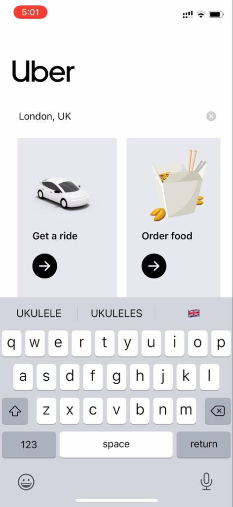

# Uber Clone

## About The Project

Uber clone is an application for cab bookings with an interface just like the real uber app and with some amazing features such as realtime trip fare estimates and time duration estimate etc..

## Built With

- React
- React Native Expo CLI
- Redux
- JavaScript

## Prerequisites

- npm ~ 8.1.0
- xcode 13
- android studio (API Level 31, gradle 7.1.1)
- Expo

## Installation

- Install libaries

```sh
yarn install
```

- Install pods

```sh
cd ios && pod install && cd ..
```

## Getting Started

- For android

```sh
npm run android
```

- For ios

```sh
npm run ios
```

**NOTE:**

```
If facing any issue while running project, install specific versions of tools used, open the project in respective platform(xcode/android studio) and build.
```

## Screens

### 1. Homescreens:

<div align="center">
  <div style="display: flex; align-items: flex-start;">
    
   
   
  </div>
</div>

### 2. Destination Screens:

<div align="center">
  <div style="display: flex; align-items: flex-start;">
    
   
  </div>
</div>

### 3. Estimates Screen:

<div align="center">
  <div style="display: flex; align-items: flex-start;">
    
    
  </div>
</div>

## And many more....

## Working Video

Watch Video Here:
https://youtube.com/shorts/AmLMEsifAJE?feature=share

## Contributions

1. Clone the Repository
2. Create your Feature Branch (`git switch -c feature/AmazingFeature`)
3. Add your changes (`git add .`)
4. Commit your Changes (`git commit -m 'Add some AmazingFeature'`)
5. Push to the Branch (`git push origin feature/AmazingFeature`)
6. Open a Pull Request & tag your reviewers
7. Don't forget to message your reviewers
